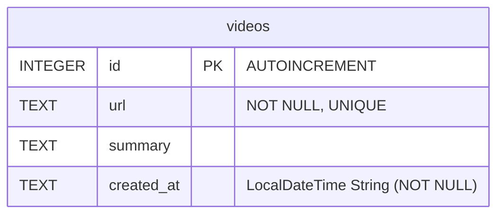
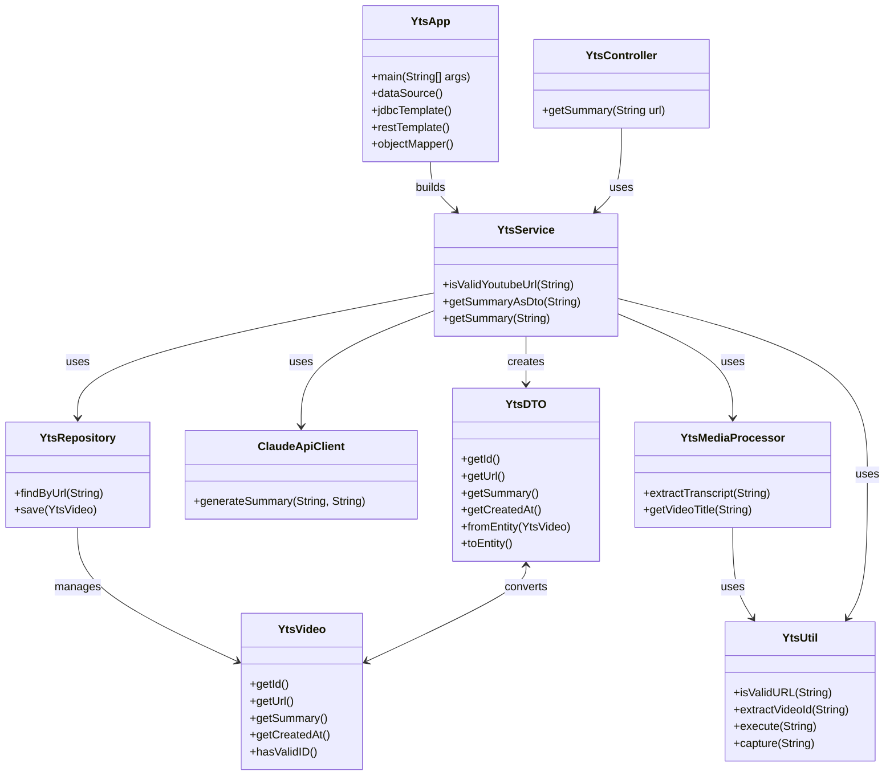

# Youtube Video Summarizer

A Spring Boot Application for Summarizing Youtube Videos

## Features
- CLI or REST API
- Web UI
- AI summarization
- DB caching

## Requirements
- Java 17+
- Maven
- yt-dlp
- whisper
- Claude API key (https://docs.anthropic.com/en/api/getting-started)

## Process
1. retrieve URL as audio file
2. transcribe via Whisper
3. summarize via Claude
4. cache and return

## Structure

```
├── pom.xml
├── README.md
├── src
│   ├── main
│   │   ├── java/com/example
│   │   │   ├── YtsApp.java
│   │   │   ├── api
│   │   │   │   ├── HomeController.java
│   │   │   │   ├── YtsController.java
│   │   │   │   └── YtsRequest.java
│   │   │   ├── common
│   │   │   │   ├── ResourceConfig.java
│   │   │   │   ├── YtsErrorType.java
│   │   │   │   ├── YtsException.java
│   │   │   │   └── YtsUtil.java
│   │   │   ├── config
│   │   │   │   └── WebConfig.java
│   │   │   ├── data
│   │   │   │   └── YtsRepository.java
│   │   │   ├── model
│   │   │   │   ├── YtsDTO.java
│   │   │   │   └── YtsVideo.java
│   │   │   └── service
│   │   │       ├── ClaudeApiClient.java
│   │   │       ├── YtsMediaProcessor.java
│   │   │       ├── YtsService.java
│   │   │       └── YtsSysCall.java
│   │   └── resources/static
│   │       ├── index.html
│   │       ├── script.js
│   │       └── style.css
│   └── test/java/com/example
│       ├── config
│       │   └── TestConfig.java
│       ├── YtsControllerTest.java
│       ├── YtsRepositoryTest.java
│       ├── YtsServiceTest.java
│       └── YtsUtilTest.java
└── video-summaries.db
```

## Database

### Configurations
| What  | Details   |
|-----  | --------- |
| Type  | SQLite / H2 |
| File  | `video-summaries.db` |
| URL   | `jdbc:sqlite:video-summaries.db` |
| Driver| `org.sqlite.JDBC` |
| ORM   | None
| Init  | Automatic |

### Schema


## SQL
```sql
-- SQLite
CREATE TABLE IF NOT EXISTS videos (
    id INTEGER PRIMARY KEY AUTOINCREMENT,
    url TEXT NOT NULL UNIQUE,
    summary TEXT,
    created_at TEXT NOT NULL
)

-- H2
CREATE TABLE IF NOT EXISTS videos (
    id INTEGER PRIMARY KEY AUTO_INCREMENT,
    url VARCHAR(2000) NOT NULL UNIQUE,
    summary CLOB,
    created_at VARCHAR(255) NOT NULL
)
```

## Class Diagram



## Usage

### Build
```bash
mvn clean package
```
### Run
```bash
mvn spring-boot:run
```

### Access
1. Web Browser: `http://localhost:8080/`
2. Shell: `Automatic (shell opens on run)`

