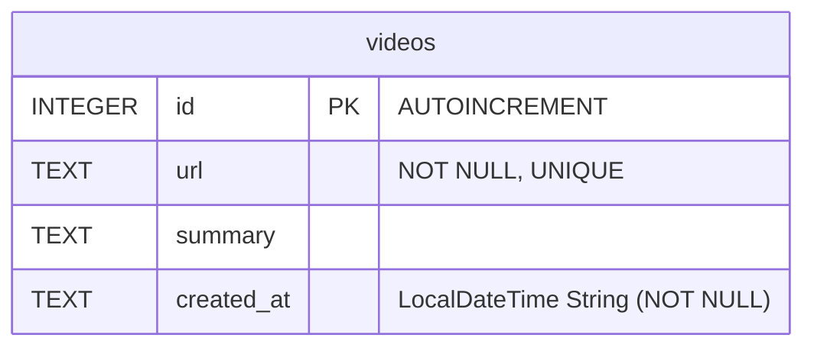
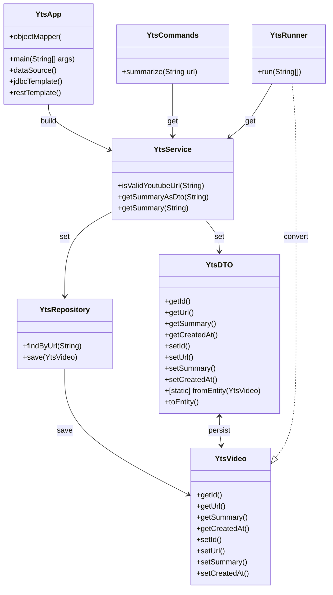

# YouTube Video Summarizer

A simple audio-parsing command-line tool 

## Prerequisites

- java 17+
- maven
- yt-dlp
- whisper 
- claude API key (Anthropic)

 Build the project: `mvn clean package`

## File Tree
```bash
# generated with cmd `tree` from project dir
├── pom.xml
├── README.md
├── spring-shell.log
├── src
│   ├── main
│   │   ├── java
│   │   │   └── com
│   │   │       └── example
│   │   │           ├── YtsApp.java
│   │   │           ├── YtsCommands.java
│   │   │           ├── YtsDTO.java
│   │   │           ├── YtsRepository.java
│   │   │           ├── YtsRunner.java
│   │   │           ├── YtsService.java
│   │   │           └── YtsVideo.java
│   │   └── resources
│   │       └── applications.properties
│   └── test
│       └── java
│           └── com
│               └── example
│                   ├── TestConstants.java
│                   ├── YtsDTOTest.java
│                   ├── YtsRepositoryTest.java
│                   └── YtsServiceTest.java
└── video-summaries.db

11 directories, 16 files
```

## Database

### Configs
| Name  |   Value   |
|-------|-----------|
| Type  | SQLite    |
| File  | `video-summaries.db`   |
| URL   | `jdbc:sqlite:video-summaries.db`  |
| Driver | `org.sqlite.JDBC`    |
| ORM   | None |
| Auto-Initialized  | Yes (on startup)  |


### Schema

### SQL
```sql
-- just showing how to create
CREATE TABLE IF NOT EXISTS videos (
    id INTEGER PRIMARY KEY AUTOINCREMENT,
    url TEXT NOT NULL UNIQUE,
    summary TEXT,
    created_at TEXT NOT NULL
)
```


## Class Design




## Usage

**Build**
```bash
mvn clean package
```
**Run**
```bash
mvn spring-boot:run 	# opens dev shell (easiest way to run) 
```

**Dev Shell**
```bash
summarize <yt-link>
```


## Process  
1. Download audio
2. Transcribe with Whisper
3. Get Summary from Claude 
4. Output To Console

**Note:** will use db storage for already requested links

